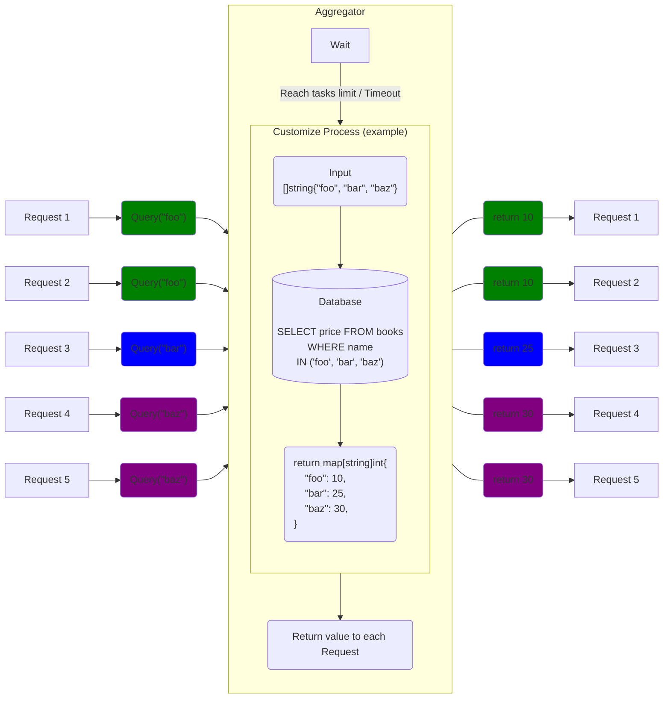

# Aggregator

[](https://pkg.go.dev/github.com/serkodev/aggregator)

Aggregator is a batch processing library for Go supports returning values. You can group up and process batch of tasks with keys in a single callback. Using it for grouping up database query or cache can help you to reduce loading of database and network.

### THIS PROJECT IS IN BETA

This project may contain bugs and have not being tested at all. Use under your own risk, but feel free to test, make pull request and improve this project.

## Features

- Support multi Aggregators (using `AggregatorList`) for fallback.
- Support multi workers to flush tasks.
- Support Go generics for query keys and result values.
- Support timeout-only or tasks limit-only.
- Support singleflight (using [singleflight-any](https://github.com/serkodev/singleflight-any)).

## Install

Currently Go 1.18+ is required (for go generics), backward compatible is planned.

```bash
go get github.com/serkodev/aggregator@latest
```

## Example

```go
callback := func(keys []string) (map[string]Book, error) {
    results := db.Query(`SELECT * FROM books WHERE name IN ?`, keys)
    return results, nil
}
agg, _ := aggregator.New(callback, 100*time.Millisecond, 5).Run()

for _, name := range []string{"foo", "foo", "bar", "baz", "baz"} {
    go func(n string) {
        book, err := agg.Query(n).Get()
        if err == nil {
            print(book.Name + ":" + book.Price, " ")
        }
    }(name)
}

// foo:10 foo:10 bar:25 baz:30 baz:30
```

## How it works



## Advance

### AggregatorList

`AggregatorList` contains a slice of `Aggregator`, you can create it by `aggregator.NewList(...)`. If the prior order aggregator cannot return data for any keys. Then `AggregatorList` will query data from the next aggregator for fallback.

For example, you create an `AggregatorList` with cache and database aggregator, when the data has not been cached, it will auto query from database.

```go
cacheAgg := aggregator.New(func(k []string) (map[string]string, error) {
    fmt.Println("fetch from cache...", k)
    return map[string]string{
        "key1": "val1",
        "key2": "val2",
    }, nil
}, 50*time.Millisecond, 10)

databaseAgg := aggregator.New(func(k []string) (map[string]string, error) {
    fmt.Println("fetch from database...", k)
    return map[string]string{
        "key1": "val1",
        "key2": "val2",
        "key3": "val3",
        "key4": "val4",
    }, nil
}, 50*time.Millisecond, 10)

list := aggregator.NewList(cacheAgg, databaseAgg).Run()
results := list.QueryMulti([]string{"key1", "key2", "key3", "key4"})

// fetch from cache... ["key1", "key2", "key3", "key4"]
// fetch from database... ["key3", "key4"]
// results: ["val1", "val2", "val3", "val4"]
```

### singleflight

In some use case you may need to prevent cache breakdown. Aggregator works with singleflight by using [singleflight-any](https://github.com/serkodev/singleflight-any) (supports Go generics).

## Inspiration

- [API Performance Tunning Story when Goalng meet with GraphQL](https://hackmd.io/zvmgdunRR8mjAjVIMx0eDA?both) - Kane Wang
- [gobatch](https://github.com/herryg91/gobatch)

## LICENSE

MIT License
